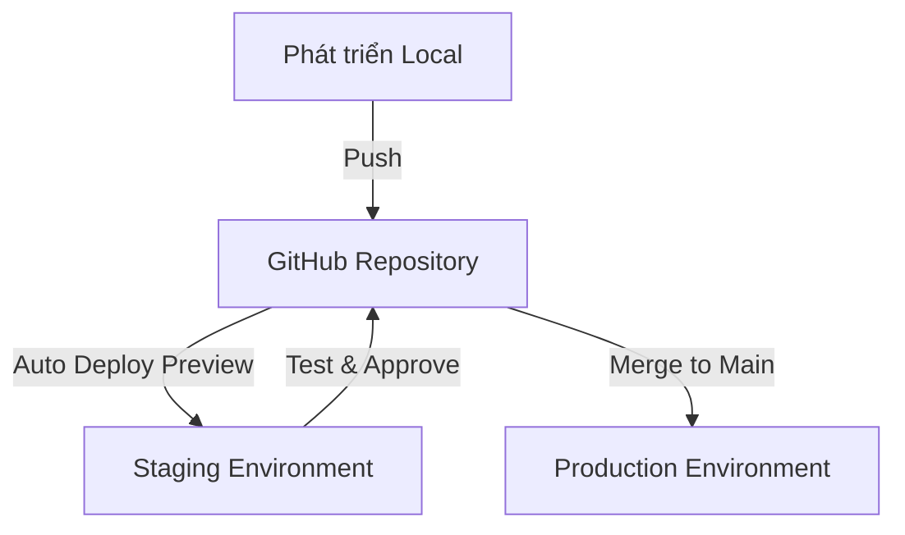

# Build Nhanh, Deploy Gọn: Tối Ưu Giai Đoạn "Xây Dựng"

Trong hai bài viết trước của series, chúng ta đã tìm hiểu về các nguyên tắc cơ bản của Lean Startup và cách xác định giả thuyết cốt lõi cùng thiết kế MVP. Bây giờ, chúng ta sẽ đi sâu vào giai đoạn "Build" (Xây dựng) trong vòng lặp Build-Measure-Learn.

Đối với solo developer, việc xây dựng nhanh và hiệu quả là vô cùng quan trọng. Mỗi ngày bạn dành để phát triển là một ngày trì hoãn việc nhận phản hồi từ người dùng thực tế. Bài viết này sẽ giúp bạn tối ưu hóa quá trình xây dựng để nhanh chóng đưa MVP ra thị trường.

## Lựa Chọn Công Nghệ Phù Hợp (Ưu Tiên Tốc Độ)

### Nguyên Tắc "Đủ Tốt" Thay Vì "Hoàn Hảo"

Khi xây dựng MVP, mục tiêu không phải là tạo ra kiến trúc hoàn hảo hay sử dụng công nghệ mới nhất. Mục tiêu là xây dựng nhanh nhất có thể một sản phẩm đủ tốt để kiểm chứng giả thuyết của bạn.

Hãy áp dụng nguyên tắc "Đủ tốt" khi lựa chọn công nghệ:

1. **Ưu tiên công nghệ bạn đã biết**: Thời điểm xây dựng MVP không phải lúc để học một ngôn ngữ/framework mới
2. **Ưu tiên công nghệ có cộng đồng lớn**: Dễ tìm giải pháp khi gặp vấn đề
3. **Ưu tiên công nghệ có nhiều thư viện/plugin**: Tránh phải "phát minh lại bánh xe"
4. **Ưu tiên công nghệ có tài liệu tốt**: Tiết kiệm thời gian tìm hiểu

### So Sánh Các Stack Phổ Biến Cho Solo Developer

| Stack | Ưu điểm | Nhược điểm | Phù hợp cho |
|-------|---------|------------|-------------|
| **Next.js + Supabase** | - Phát triển nhanh<br>- Tích hợp sẵn auth, DB<br>- Serverless<br>- Deploy dễ dàng | - Có thể bị vendor lock-in<br>- Ít kiểm soát ở low-level | MVP web app với auth và DB |
| **T3 Stack (Next.js, Prisma, tRPC, Tailwind)** | - Type-safe từ DB đến UI<br>- DX tốt<br>- Mở rộng dễ dàng | - Đường cong học tập cao hơn<br>- Setup phức tạp hơn | MVP cần type safety và có thể mở rộng |
| **Firebase + React** | - Phát triển cực nhanh<br>- Không cần backend<br>- Realtime DB | - Chi phí có thể tăng nhanh<br>- Ít kiểm soát | MVP cần realtime và auth |
| **Django/Rails** | - All-in-one<br>- CRUD nhanh<br>- Admin dashboard sẵn có | - Deployment phức tạp hơn<br>- Ít linh hoạt với SPA | MVP với nhiều CRUD và admin panel |
| **No-code/Low-code (Bubble, Webflow)** | - Phát triển nhanh nhất<br>- Không cần code<br>- Nhiều plugin | - Khả năng tùy chỉnh hạn chế<br>- Khó mở rộng<br>- Chi phí dài hạn cao | MVP đơn giản để validate ý tưởng |

### Lựa Chọn BaaS/PaaS Để Tăng Tốc

Backend-as-a-Service (BaaS) và Platform-as-a-Service (PaaS) là những lựa chọn tuyệt vời để tăng tốc phát triển MVP:

#### BaaS Phổ Biến:

1. **Supabase**: PostgreSQL + Auth + Storage + Realtime + Edge Functions
   - **Ưu điểm**: Open-source, API tự động từ schema DB, RLS mạnh mẽ
   - **Use case**: Web/mobile app cần DB quan hệ, auth, và storage

2. **Firebase**: Firestore + Auth + Storage + Functions + Hosting
   - **Ưu điểm**: Realtime, tích hợp Google, nhiều SDK
   - **Use case**: App cần realtime và tích hợp với Google

3. **Appwrite**: Open-source alternative to Firebase
   - **Ưu điểm**: Self-host option, API đơn giản
   - **Use case**: Khi cần kiểm soát dữ liệu nhiều hơn Firebase

#### PaaS Phổ Biến:

1. **Vercel**: Hosting + Serverless Functions + Edge
   - **Ưu điểm**: CI/CD tích hợp, preview deployments, tối ưu cho Next.js
   - **Use case**: Frontend và full-stack JS apps

2. **Netlify**: Hosting + Functions + Forms
   - **Ưu điểm**: CI/CD tích hợp, forms handling, split testing
   - **Use case**: Static sites và Jamstack apps

3. **Railway**: PaaS đơn giản cho nhiều loại app
   - **Ưu điểm**: Setup nhanh, hỗ trợ nhiều runtime
   - **Use case**: Khi cần deploy nhanh nhiều loại service

### Ví Dụ: Lựa Chọn Stack Cho Các Loại MVP Phổ Biến

| Loại MVP | Stack Đề Xuất | Lý Do |
|----------|---------------|-------|
| Landing page + waitlist | Next.js + Vercel + Supabase (email storage) | Setup nhanh, zero-config, miễn phí để bắt đầu |
| Marketplace đơn giản | T3 Stack + Stripe | Type-safety giúp tránh bug khi xử lý thanh toán |
| SaaS với subscription | Next.js + Supabase + Stripe | Auth và DB sẵn có, tích hợp Stripe dễ dàng |
| Mobile app đơn giản | React Native + Expo + Firebase | Phát triển nhanh cho cả iOS và Android |
| Content platform | Next.js + Sanity/Contentful | Headless CMS giúp quản lý nội dung dễ dàng |

## Sử Dụng Framework/Boilerplate/Low-code

### Tận Dụng Boilerplate và Starter Templates

Không cần phải bắt đầu từ đầu. Có rất nhiều boilerplate và starter templates chất lượng cao có thể giúp bạn tiết kiệm hàng tuần phát triển:

1. **[Create T3 App](https://create.t3.gg/)**: Boilerplate cho T3 Stack với Next.js, Prisma, tRPC, Tailwind, NextAuth
2. **[Supabase Starter Templates](https://github.com/supabase/supabase/tree/master/examples)**: Nhiều template cho các use case phổ biến với Supabase
3. **[Next.js Templates](https://vercel.com/templates)**: Các template chính thức từ Vercel
4. **[Refine](https://refine.dev/)**: Framework để xây dựng CRUD apps nhanh chóng
5. **[Blitz.js](https://blitzjs.com/)**: Full-stack React framework lấy cảm hứng từ Ruby on Rails

### Sử Dụng UI Component Libraries

Thay vì xây dựng UI từ đầu, hãy sử dụng các thư viện component có sẵn:

1. **[Tailwind UI](https://tailwindui.com/)**: Components được xây dựng với Tailwind CSS
2. **[Chakra UI](https://chakra-ui.com/)**: Thư viện component accessible và customizable
3. **[Material UI](https://mui.com/)**: Implementation của Material Design cho React
4. **[Shadcn UI](https://ui.shadcn.com/)**: Components đẹp, có thể copy-paste và tùy chỉnh
5. **[Mantine](https://mantine.dev/)**: Thư viện React components với hooks hữu ích

### Low-code Tools Cho Developer

Các công cụ low-code không chỉ dành cho non-developers. Nhiều công cụ được thiết kế đặc biệt cho developers để tăng tốc quá trình phát triển:

1. **[Retool](https://retool.com/)**: Xây dựng internal tools và dashboards nhanh chóng
2. **[Plasmic](https://www.plasmic.app/)**: Visual builder tích hợp với codebase
3. **[Amplication](https://amplication.com/)**: Tạo backend Node.js từ UI
4. **[Nhost](https://nhost.io/)**: BaaS với GraphQL API tự động
5. **[Wasp](https://wasp-lang.dev/)**: DSL để định nghĩa full-stack JS apps

## Tích Hợp AI Code Assistants

AI Code Assistants đã trở thành công cụ không thể thiếu để tăng tốc phát triển, đặc biệt cho solo developers.

### Các AI Code Assistant Phổ Biến

1. **GitHub Copilot**: Tích hợp với nhiều IDE, gợi ý code dựa trên context
2. **ChatGPT (OpenAI)**: Đa năng, có thể giúp debug, giải thích code, và tạo boilerplate
3. **Claude (Anthropic)**: Tốt cho việc giải thích và refactor code phức tạp
4. **Codeium**: Alternative miễn phí cho Copilot
5. **Tabnine**: Tập trung vào code completion

### Chiến Lược Sử Dụng AI Hiệu Quả

Để tận dụng tối đa AI Code Assistants:

1. **Viết comments chi tiết**: Mô tả rõ ràng những gì bạn muốn làm trước khi để AI generate code
2. **Chia nhỏ vấn đề**: Yêu cầu AI giải quyết từng phần nhỏ thay vì toàn bộ feature
3. **Review code kỹ lưỡng**: Luôn kiểm tra code được generate, đặc biệt là security và edge cases
4. **Sử dụng AI để học**: Yêu cầu AI giải thích code nó tạo ra để học hỏi
5. **Tạo boilerplate và tests**: AI đặc biệt hữu ích cho việc tạo code template và unit tests

### Ví Dụ Prompt Hiệu Quả Cho AI

```
Tôi đang xây dựng một ứng dụng Next.js với Supabase. Hãy giúp tôi tạo một Server Action để:
1. Xác thực người dùng đã đăng nhập
2. Tạo một bản ghi mới trong bảng 'projects' với các trường: title, description, user_id
3. Xử lý lỗi và trả về kết quả phù hợp

Đây là cấu trúc bảng 'projects':
- id: uuid, primary key
- title: text, not null
- description: text
- user_id: uuid, foreign key references users.id
- created_at: timestamp with time zone, default: now()

Hãy sử dụng Supabase JS Client v2 và bao gồm cả validation với Zod.
```

## Thiết Lập CI/CD Đơn Giản

Continuous Integration/Continuous Deployment (CI/CD) không chỉ dành cho team lớn. Solo developers cũng có thể hưởng lợi từ việc tự động hóa quy trình build và deploy.

### CI/CD Đơn Giản Cho Solo Developer

1. **Vercel/Netlify Integration**: Tự động deploy khi push lên GitHub
2. **GitHub Actions cơ bản**: Chạy tests và linting tự động
3. **Supabase CLI trong CI**: Quản lý migrations DB trong CI pipeline

### Thiết Lập Môi Trường Dev/Staging/Prod

Ngay cả với MVP, việc có các môi trường riêng biệt cũng rất quan trọng:

1. **Development**: Môi trường local của bạn
2. **Staging**: Bản sao của production để test trước khi deploy
3. **Production**: Môi trường người dùng thực tế sử dụng

Với Vercel/Netlify + Supabase, bạn có thể dễ dàng thiết lập:
- Preview deployments cho mỗi PR (Vercel/Netlify)
- Supabase Projects riêng cho dev/staging/prod

### Workflow Đơn Giản Nhưng Hiệu Quả



## "Ship Sớm, Ship Thường Xuyên"

### Triết Lý "Done Is Better Than Perfect"

Trong Lean Startup, việc đưa sản phẩm ra thị trường sớm quan trọng hơn việc làm cho nó hoàn hảo. Hãy nhớ:

- Người dùng không quan tâm đến code của bạn "đẹp" đến đâu
- Feedback sớm giúp bạn tránh xây dựng những thứ không ai cần
- Bạn luôn có thể cải thiện sản phẩm sau khi đã validate ý tưởng

### Chiến Lược Phát Hành Hiệu Quả

1. **Phát hành theo giai đoạn**: Bắt đầu với closed beta, sau đó mở rộng dần
2. **Feature flags**: Cho phép bật/tắt tính năng mới mà không cần deploy lại
3. **Canary releases**: Phát hành cho một phần nhỏ người dùng trước
4. **Rollback plan**: Luôn có kế hoạch B nếu có vấn đề xảy ra

### Cân Bằng Tốc Độ và Chất Lượng

Tốc độ không có nghĩa là bỏ qua chất lượng hoàn toàn. Hãy tập trung vào:

1. **Automated testing cho core functionality**: Đảm bảo các tính năng cốt lõi hoạt động đúng
2. **Monitoring đơn giản**: Biết khi nào có lỗi xảy ra
3. **Technical debt có kiểm soát**: Ghi chú những phần cần refactor sau
4. **Bảo mật cơ bản**: Không bỏ qua các vấn đề bảo mật cơ bản

## Ví Dụ Thực Tế: Xây Dựng MVP Trong 1 Tuần

Hãy xem một ví dụ cụ thể về cách áp dụng các nguyên tắc trên để xây dựng MVP trong vòng 1 tuần:

### Ý Tưởng: Nền Tảng Chia Sẻ Tài Liệu Cho Developer

**Giả thuyết cốt lõi**: "Developers cần một nơi để chia sẻ và tìm kiếm tài liệu kỹ thuật được cộng đồng đánh giá cao."

### Ngày 1: Setup & Planning

1. **Lựa chọn stack**: Next.js + Supabase + Vercel + Tailwind UI
2. **Setup project**:
   ```bash
   npx create-next-app@latest my-project --typescript --tailwind --app
   ```
3. **Kết nối Supabase**:
   - Tạo project trên Supabase
   - Setup schema DB cơ bản
   - Cấu hình authentication

### Ngày 2-3: Core Features

1. **Authentication flow**:
   - Sign up/Sign in với GitHub OAuth
   - Profile page đơn giản
2. **Document submission**:
   - Form đăng tài liệu (URL, title, description, tags)
   - Validation cơ bản

### Ngày 4-5: Browse & Search

1. **Homepage với danh sách tài liệu**:
   - Sắp xếp theo thời gian/đánh giá
   - Filtering đơn giản theo tags
2. **Search functionality**:
   - Full-text search với Supabase

### Ngày 6: Voting & Comments

1. **Upvote/downvote system**:
   - Optimistic UI updates
   - Rate limiting đơn giản
2. **Comments cơ bản**:
   - Thêm/xóa comment

### Ngày 7: Polish & Deploy

1. **UI/UX improvements**:
   - Mobile responsiveness
   - Dark/light mode
2. **Final deployment**:
   - Setup production environment
   - Monitoring cơ bản

### Kết Quả

Sau 1 tuần, bạn có một MVP hoạt động được với các tính năng cốt lõi:
- Authentication
- Document submission & browsing
- Voting & comments
- Search functionality

Đủ để kiểm chứng giả thuyết cốt lõi và thu thập feedback từ early adopters.

## Kết Luận

Giai đoạn "Build" trong vòng lặp Lean Startup không phải về việc xây dựng sản phẩm hoàn hảo, mà là về việc xây dựng nhanh nhất có thể một sản phẩm đủ tốt để kiểm chứng giả thuyết của bạn.

Bằng cách:
- Lựa chọn công nghệ phù hợp (ưu tiên tốc độ)
- Tận dụng framework/boilerplate/low-code
- Tích hợp AI Code Assistants
- Thiết lập CI/CD đơn giản
- Áp dụng triết lý "Ship sớm, Ship thường xuyên"

Bạn có thể đưa MVP ra thị trường nhanh chóng, thu thập feedback sớm, và tăng đáng kể cơ hội thành công cho dự án của mình.

Trong bài viết tiếp theo của series, chúng ta sẽ tìm hiểu cách "Đo Lường Đúng Cách Khi Bạn Chỉ Có Một Mình" - các chiến lược để thu thập và phân tích dữ liệu hiệu quả trong giai đoạn "Measure" của vòng lặp Lean Startup.

## Tài Liệu Tham Khảo

1. Ries, Eric. "The Lean Startup: How Today's Entrepreneurs Use Continuous Innovation to Create Radically Successful Businesses." Crown Business, 2011.
2. Humble, Jez and David Farley. "Continuous Delivery: Reliable Software Releases through Build, Test, and Deployment Automation." Addison-Wesley, 2010.
3. [Supabase Documentation](https://supabase.com/docs)
4. [Next.js Documentation](https://nextjs.org/docs)
5. [Vercel Documentation](https://vercel.com/docs)
6. [GitHub Copilot Documentation](https://docs.github.com/en/copilot)
7. [T3 Stack Documentation](https://create.t3.gg/)